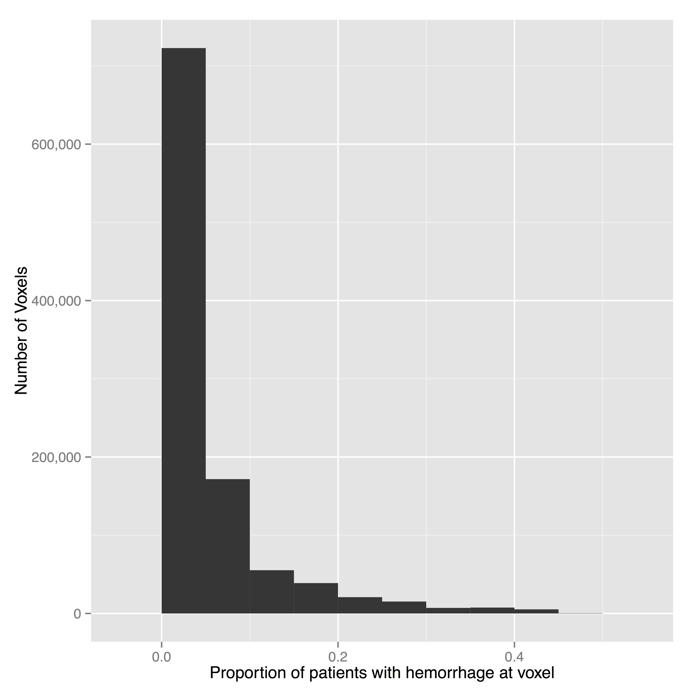

## Neuroimaging Data - voxels = 3D pixels

---

## DICOM - slicing a salami

---

## NIfTI - a 3D brain! 

Note the Gantry tilt - (cone heading)

---

## Gantry Tilt - It's a Brain!

---

## Brain Extraction!

---

## Registration

* Chris Rorden has released a [Clinical Toolbox](http://www.mccauslandcenter.sc.edu/CRNL/clinical-toolbox)
* Has a **CT Template**!
* Uses SPM to do spatial co-registration "Normalization".
* Must mask out the lesion / stroke.
* MISTIE and ICES - 111 patients

---

## Registered Images and Masks

---

## Population ICH

---

## Voxel-wise Regression

$$
Y_i = \beta_0+\beta_1(v) + \epsilon_{iv}, 
$$

---

## Regressing on ROI Coverage

$$
{\rm NIHSS}_i = \beta_0 + \beta_1 {\rm Coverage}_i + \gamma_1{\rm Age}_i  +\gamma_2{\rm Gender}_i +\gamma_3{\rm TICHVol}_i + \epsilon_{i}
$$

$$
{\rm GCS}_i = \beta_0 + \beta_1 {\rm Coverage}_i + \gamma_1{\rm Age}_i  +\gamma_2{\rm Gender}_i +\gamma_3{\rm TICHVol}_i + \epsilon_{i}
$$

---
## Regressing on ROI Coverage

---

## Results for NIHSS

$$
{\rm NIHSS}_i = \beta_0 + \beta_1 {\rm Coverage}_i + \gamma_1{\rm Age}_i  +\gamma_2{\rm Gender}_i +\gamma_3{\rm TICHVol}_i + \epsilon_{i}
$$

---

## Results for GCS

$$
{\rm GCS}_i = \beta_0 + \beta_1 {\rm Coverage}_i + \gamma_1{\rm Age}_i  +\gamma_2{\rm Gender}_i +\gamma_3{\rm TICHVol}_i + \epsilon_{i}
$$

