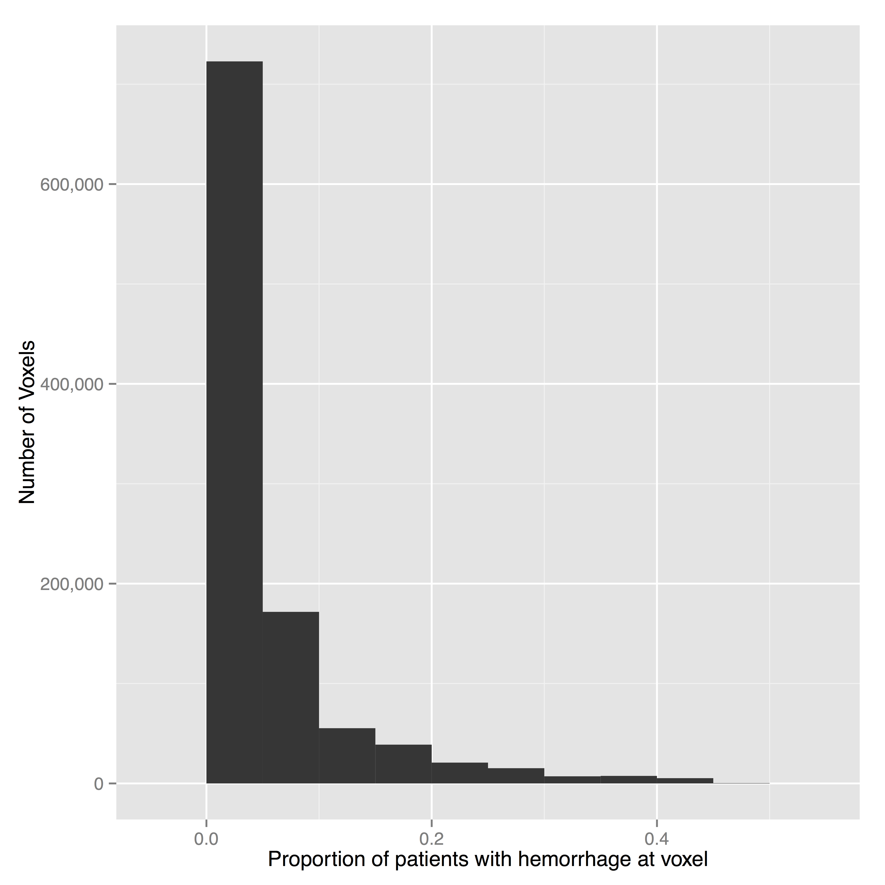
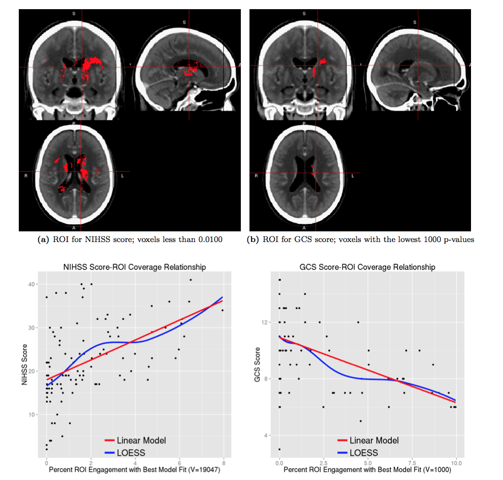

## CT Brain Extraction!

---

## Registering CT Images and Masks to a Template

---

## Population ICH

---

## Voxel-wise Regression

$$
Y_i = \beta_0+\beta_1(v) + \epsilon_{iv}, 
$$

---

## Regressing on ROI Coverage

---

