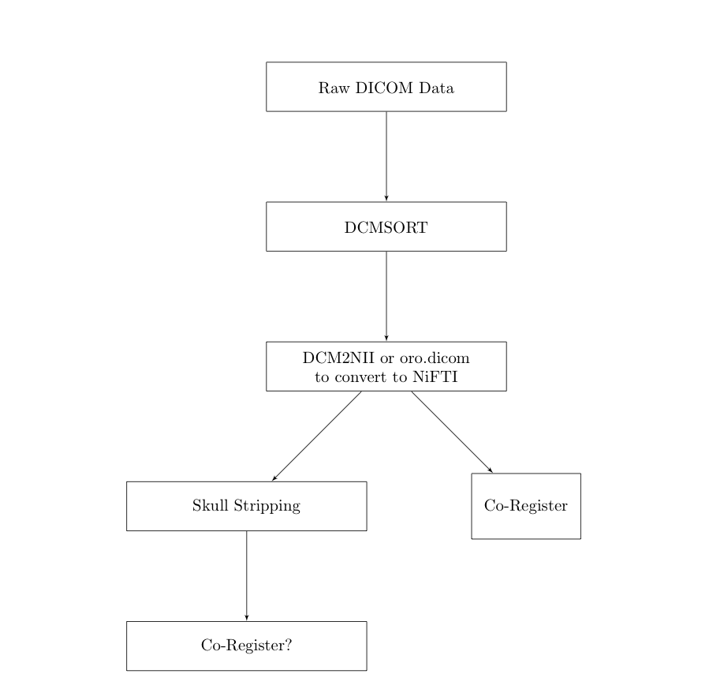
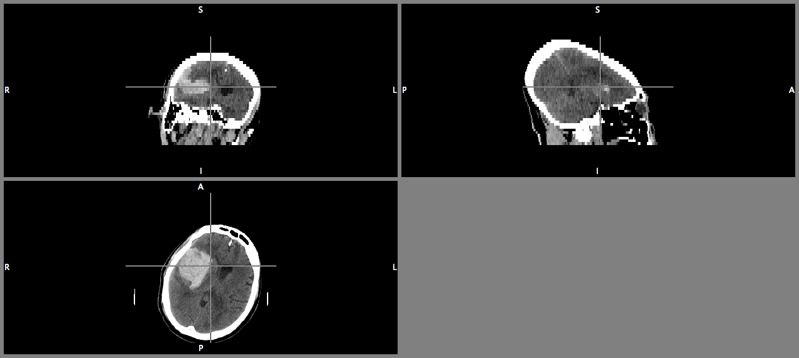

## Registration

* Chris Rorden has released a [Clinical Toolbox](http://www.mccauslandcenter.sc.edu/CRNL/clinical-toolbox)
* Has a **CT Template**!
* Uses SPM to do spatial co-registration "Normalization".
* Must mask out the lesion / stroke.

---

## SPM

* Must align to AC/PC line
    * ACPCdetect is on NITRC in ART (automatic registration toolbox) [Here](http://www.nitrc.org/forum/forum.php?forum_id=1927)
    * Chris Rorden has scripts to do this in [SPM8](http://www.mccauslandcenter.sc.edu/CRNL/tools/spm8-scripts)
    * I've done it manually
    * May use Skull Stripping.
* Doesn't use .nii.gz files
* Uses MATLAB

---

## How many patients

* CLEAR IVH - 100 patients
* MISTIE and ICES - 144 patients
* CLEAR III - currently 350 patients (to be 500)
* MISTIE III - 500 patients (just funded)

---

## Data Types

* CT Data - all ROIs are done on axial based CT - also have some saggital and coronal
    * Have follow-up scans that have no blood, but still deformation

---

## What's done - Flow
After Data has been exported from OsiriX:

---

## CT Image - I have big blood and I can not lie

---

## Gantry Tilt - Cone heading

---

## Gantry Tilt - It's a Brain!

---

